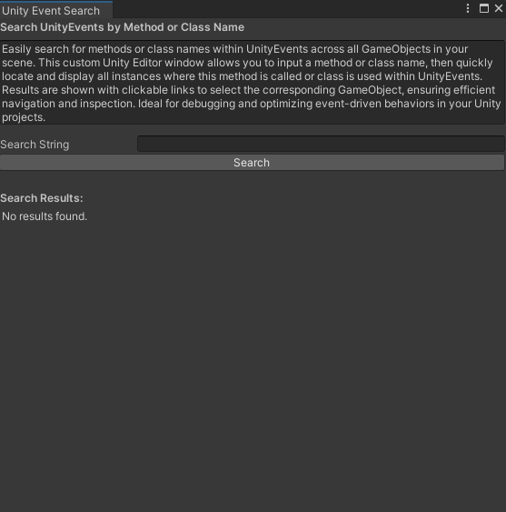

# Unity Event Search Window

This custom Unity Editor window allows you to search for methods and class names used within UnityEvents across all GameObjects in your scene. It's designed to help you quickly locate and display all instances where specific methods are called or classes are used within UnityEvents, making debugging and optimizing event-driven behaviors in your Unity projects more efficient.

## Features

- Search for methods or class names within UnityEvents.
- Display all instances where the search term is found.
- Clickable links to select the corresponding GameObject.
- Easy navigation and inspection of UnityEvents.

## Installation

1. Clone or download this repository.
2. Copy the `UnityEventSearchWindow.cs` script into your Unity project's `Editor` folder.

## Usage

1. Open Unity and go to `Tools > Unity Event Search`.
2. In the Unity Event Search window, enter the method name or class name you want to search for in the "Search String" field.
3. Click the "Search" button.
4. The search results will be displayed with clickable links to select the corresponding GameObject.

## Example

1. Open the Unity Event Search window from the Tools menu.
2. Enter the name of a method or class you are looking for.
3. Click "Search" and see the results populated below.

## Contributing

If you find any bugs or have suggestions for improvements, please open an issue or submit a pull request.

## License

This project is licensed under the MIT License - see the [LICENSE](LICENSE) file for details.
